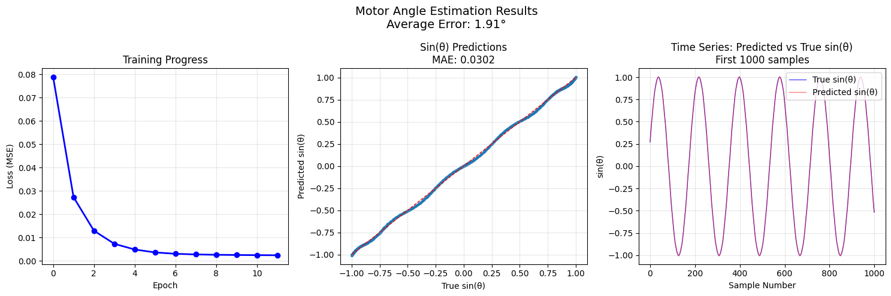

# PMSM Neural Network Angle Estimator

A complete simulation framework and data science project for developing a neural network-based sensorless control system for a Permanent Magnet Synchronous Motor (PMSM). This project demonstrates a full workflow from data generation to model training and testing.

Highlights:
- **Dynamic PMSM Simulation**: A flexible Python framework to simulate motor dynamics under various speed and load conditions.
- **Data Generation**: The Simulation is directly outputting a structured .csv file for the direct use later.
- **Data Analysis**: Includes a exploratory data analysis (`01_eda.ipynb`) to vizualize motor characteristics and data quality.
- **Neural Network Angle Estimation**: Trains a neural network (`02_machine_learning.ipynb`) to estimate the rotor angle using only electrical measurements (alpha/beta currents and voltages), enabling sensorless motor control.
- **Testing Suite**: Utilizes a tests directory with unit tests for core functionalities, ensuring code reliability.


## Getting startet
To get it locally running you have to do the following steps:
- install uv
```
pip install uv
```
- create and activate environment
```
uv venv
source .venv/bin/activate # Linux/macOS
# .venv\Scripts\activate # Windows
```

- installl dependencies
```
uv sync
```

## Project Workflow
1. Simulation:  Run `scripts/run_pmsm_sim.py` to generate raw motor data.
2. Data Curation: Data is saved to a .csv file.
3. EDA: The `01_eda.ipynb` notebook provides insights into the generated data.
4. Model Training: The `02_machine_learning.ipynb` notebook trains the angle estimation model.
5. Validation: Test scripts verify the functionality of individual components.


## Model Architecture 
The core of this project is a feedforward neural network designed to estimate the motor's rotor angle.

|Layer|Type|I/O Size|Activation|
|-----|----|-----|----|
|Input|Dense| 4 (Uαβ, Iαβ)|N/A|
|Hidden|Dense|12|ReLu|
|Output|Dense|2 (sin/cos(θ))|Linear|

This architecture allows the network to learn the non-linear relationship between the motor's voltage/current inputs and the sinusoidal representation of the rotor angle.

Activation Function Rationale Rectified Linear Unit (ReLu) for Hidden Layer: 
- ReLu was chosen for the hidden layer because it is highly effective at introducing the necessary non-linearity required to map the complex input signals (voltages and currents) to the motor's state. It helps mitigate the vanishing gradient problem, allowing the network to train efficiently and quickly converge to an optimal solution.
Linear Activation for Output Layer: 
- The output layer uses a linear activation function because the goal is to predict raw, continuous numerical values for \(sin(\theta )\) and \(cos(\theta )\). A linear activation simply outputs the weighted sum of the inputs, making it suitable for this regression task where the model needs to approximate values within a specific continuous range (-1.0 to 1.0). 


## Result
The model demonstrates excellent convergence and highly accurate angle estimations. The following plots from the training and validation phase are included below:


Key Results:
- Average Angle error of 1,91°
- Sin(θ) Predictions MAE: 0.0302

The time series plot clearly shows the predicted values (red line) closely tracking the true values (blue line), confirming the model's high accuracy in real-time estimation scenarios.